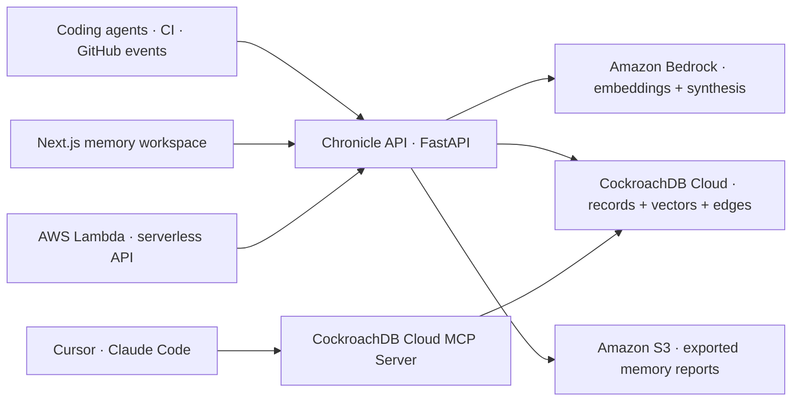

# Chronicle

> Persistent engineering memory for AI coding agents.

Chronicle gives coding agents a durable record of why software changed—not just what happened in the last prompt. Architectural decisions, rejected approaches, incidents, fixes, migrations, API changes, and deployment history become connected, queryable engineering memory.

It is deliberately not a chatbot or generic RAG surface. The product is the memory system: agents capture durable events, retrieve them by meaning and keyword, traverse causal links, and leave an auditable reasoning trail for the next engineer or agent.

## Why it stands out

- One system of record: CockroachDB stores the operational event, vector embedding, full-text document, relationship edges, and retrieval audit in a consistent database.
- Hybrid recall: “Why did authentication change?” brings back the decision, the failed alternative, and the subsequent fix—not a transcript fragment.
- Engineering-native views: explorer, timeline, graph, memory inspector, relationship evidence, agent attribution, commit context, and recent capture.
- Runs immediately: a seeded demo works without an AWS account or database. Production mode swaps in CockroachDB Cloud and Amazon Bedrock through environment configuration.

## Architecture



The frontend never receives database credentials. FastAPI owns ingestion, retrieval policy, Bedrock invocation, and report export. CockroachDB Cloud’s Managed MCP Server separately lets a coding agent inspect the very same schema and data with OAuth-scoped access.

## Hackathon technologies

| Technology | How Chronicle uses it |
| --- | --- |
| CockroachDB Distributed Vector Indexing | `memories.embedding` is a `VECTOR(512)` column with a project-prefixed cosine vector index. Semantic retrieval keeps vectors and transactional engineering facts in one durable store. |
| CockroachDB Cloud Managed MCP Server | [`.cursor/mcp.json`](.cursor/mcp.json) connects Cursor to `https://cockroachlabs.cloud/mcp`, scoped to one cluster through the required `mcp-cluster-id` header. Agents can inspect the live Chronicle schema and query it directly. |
| Amazon Bedrock | Titan Text Embeddings V2 creates normalized 512-dimension embeddings. Bedrock Converse optionally produces concise, evidence-bounded synthesis with memory-ID citations. |
| AWS Lambda | `backend/app/lambda_handler.py` and [`infra/template.yaml`](infra/template.yaml) package the FastAPI API for Lambda + API Gateway. |
| Amazon S3 | `POST /api/v1/exports` writes an immutable JSON memory report to a configured bucket. |

CockroachDB’s [vector-index documentation](https://www.cockroachlabs.com/docs/stable/vector-indexes) covers the prefix-column and cosine-index pattern used here. The MCP setup follows Cockroach Labs’ [Cloud MCP configuration](https://www.cockroachlabs.com/docs/cockroachcloud/connect-to-the-cockroachdb-cloud-mcp-server). Bedrock integration uses [Titan Text Embeddings V2](https://docs.aws.amazon.com/bedrock/latest/userguide/titan-embedding-models.html) and the [Converse API](https://docs.aws.amazon.com/bedrock/latest/userguide/conversation-inference.html).

## Quick start — seeded demo

The demo starts without a CockroachDB cluster or AWS credentials. Its deterministic local retrieval provider only exists to make the UI evaluable offline; the production path uses Bedrock and CockroachDB.

Open two terminals from the repository root:

```bash
# Terminal 1: API
cd backend
python3 -m venv .venv
.venv/bin/python -m pip install -e ".[dev]"
.venv/bin/uvicorn app.main:app --reload --port 8000
```

```bash
# Terminal 2: web app
cd frontend
npm install
npm run dev
```

Open [http://localhost:3000](http://localhost:3000). Search `Why did authentication change?`, then inspect the decision, the rejected refresh-token cache, and the OAuth fix. Switch to Timeline and Graph to show that the context is durable and causal rather than conversational.

### Demo script for judges

1. Start on **Explorer** and search `Why did authentication change?`.
2. Select **Moved session validation to the edge gateway**. Point out its source commit, agent, confidence, direct graph edges, and reasoning trail.
3. Select **Timeline**. The history is a chronological engineering record, not a chat log.
4. Select **Graph**. Show the failed approach leading to the decision and the decision enabling the fix.
5. Search `What did we learn about deployment audits?` to show a second domain of persistent context.

## Production setup

### 1. Create the memory database

Create a CockroachDB Cloud cluster, then copy its connection string. Run the migration using a cluster admin; it enables the vector-index feature before creating the empty vector index.

```bash
cockroach sql --url "$DATABASE_URL" --file=infra/schema.sql
```

Copy `backend/.env.example` to `backend/.env` and set at least:

```dotenv
DATABASE_URL=postgresql://…
USE_BEDROCK=true
AWS_REGION=us-east-1
```

The selected Titan embedding model accepts 256, 512, or 1024 dimensions. Chronicle configures 512 and the SQL schema enforces the same dimension count.

### 2. Enable Bedrock

Configure AWS credentials for the process running FastAPI and grant `bedrock:InvokeModel` for the configured embedding and text models. Enable access to `amazon.titan-embed-text-v2:0` and your configured Converse-compatible model in the selected AWS region.

### 3. Connect the coding agent through MCP

1. Copy [`.cursor/mcp.json`](.cursor/mcp.json) into your project’s Cursor configuration if needed.
2. Replace `replace-with-your-cockroachdb-cloud-cluster-id` with the Cloud cluster ID from the Console URL.
3. Restart Cursor and authenticate using OAuth. Start with a staging cluster or read-only permissions while reviewing agent behavior.

For API-key authentication, add an `Authorization: Bearer …` header locally—never commit it. CockroachDB’s MCP server then offers schema inspection, `SELECT`, `EXPLAIN`, and approved write operations to the configured cluster.

### 4. Run local services against production integrations

```bash
cd backend
.venv/bin/uvicorn app.main:app --port 8000
```

```bash
cd frontend
cp .env.local.example .env.local
npm run dev
```

## Deployment

### Serverless API on AWS

The AWS SAM template deploys FastAPI with Mangum on Lambda + API Gateway:

```bash
sam build --template-file infra/template.yaml
sam deploy --guided
```

Supply the CockroachDB connection string for `DatabaseUrl`. Give the function `bedrock:InvokeModel` only for the models you use, and narrow the generated S3 policy to the export bucket before production deployment. Set `NEXT_PUBLIC_API_URL` in the frontend deployment to the API Gateway URL.

### Local container stack

For a local CockroachDB-backed stack, use Docker Compose:

```bash
docker compose up --build
```

The `migrate` service runs [`infra/schema.sql`](infra/schema.sql) before the API starts. The standalone frontend then runs at [http://localhost:3000](http://localhost:3000).

## API surface

| Endpoint | Purpose |
| --- | --- |
| `GET /health` | Liveness and demo/live mode. |
| `GET /api/v1/dashboard` | Project-level statistics, featured memories, and capture activity. |
| `GET /api/v1/memories?q=&mode=hybrid` | Semantic, keyword, or hybrid memory retrieval. |
| `POST /api/v1/memories` | Capture a durable engineering event and its embedding. |
| `GET /api/v1/memories/{id}` | Inspector detail with direct relationships. |
| `GET /api/v1/timeline` | Chronological memory groups. |
| `GET /api/v1/graph/{id}` | Focused causal subgraph. |
| `POST /api/v1/ask` | Evidence-bounded Bedrock synthesis with cited memory IDs. |
| `POST /api/v1/exports` | Export a JSON report; uploads to S3 when configured. |

Interactive API documentation is available at [http://localhost:8000/docs](http://localhost:8000/docs) while the API is running.

## Data model

| Table | Responsibility |
| --- | --- |
| `projects` | Repository-scoped isolation and project metadata. |
| `memories` | Durable event facts, source, timestamp, tags, confidence, importance, git context, `TSVECTOR`, and `VECTOR(512)` embedding. |
| `memory_relationships` | Typed directed edges such as `led_to`, `enabled`, `supersedes`, and `prevented_repeat`. |
| `memory_access_log` | Auditable agent/human inspection and retrieval events. |

The detailed rationale, operational risks, and schema decisions live in [docs/architecture.md](docs/architecture.md).

## Quality checks

```bash
cd backend && .venv/bin/python -m pytest -q && .venv/bin/ruff check app tests
cd frontend && npm run lint && npm run typecheck && npm run build
```

## Screenshots and video

Screenshot placeholders are listed in [docs/screenshots](docs/screenshots/README.md). For the required sub-three-minute video, use the demo script above: 20 seconds on the problem, 70 seconds on explorer/inspector, 35 seconds on timeline/graph, and 35 seconds on CockroachDB + Bedrock + MCP architecture.

## Repository structure

```text
backend/        FastAPI, CockroachDB repository, Bedrock integration, Lambda handler, tests
frontend/       Next.js workspace, interaction state, dark editorial UI
infra/          CockroachDB schema and AWS SAM deployment template
.cursor/        CockroachDB Cloud MCP configuration
docs/           Architecture decisions and submission assets
```

## License

Chronicle is available under the [MIT License](LICENSE).
